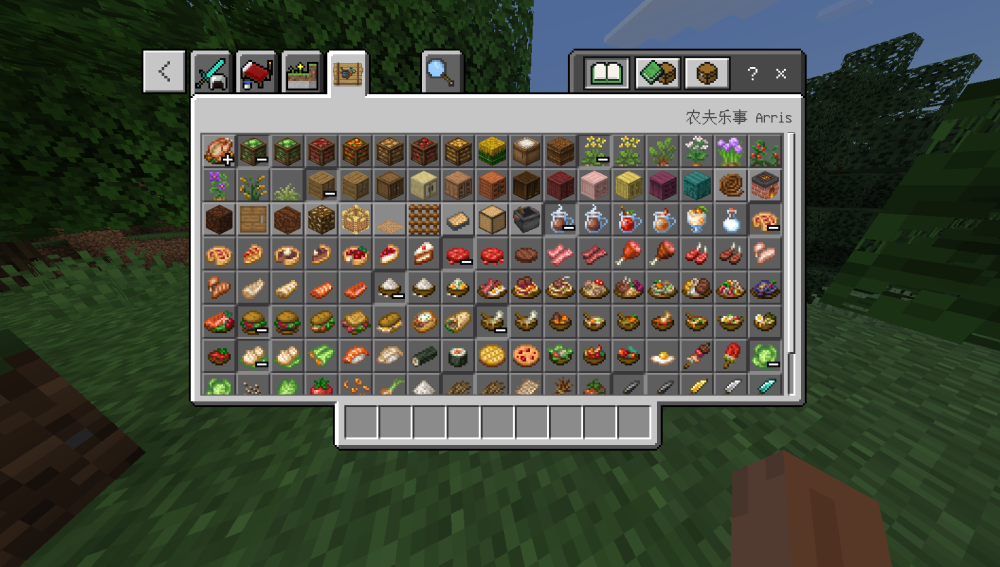
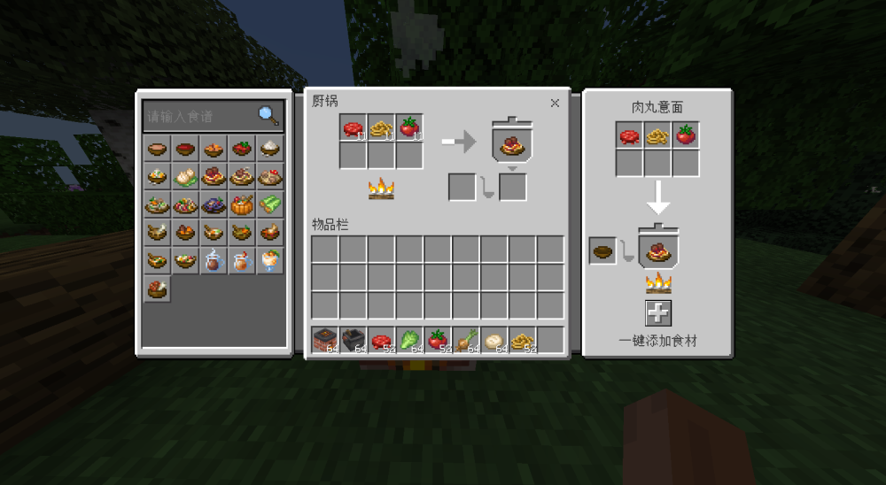
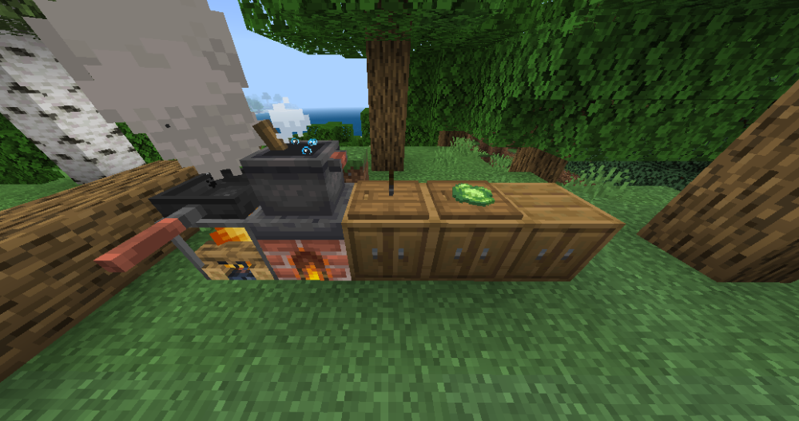

# arrisFarmersDelight 
### 棱花Arris 网易版农夫乐事
> - 基于QyMod开发
> - 直接导入MC Studio即可使用
#### 由于学业和其它模组开发工作过多
#### 暂无精力继续开发农夫乐事模组
#### 现开源给各位开发者学习
###### 写的史山勿喷QAQ
##### 厨锅容器UI、UI数据绑定、方块状态、方块实体...
>如有问题 [联系作者](https://wpa.qq.com/msgrd?v=3&uin=1493623908&site=qq&menu=yes)
## 效果图

